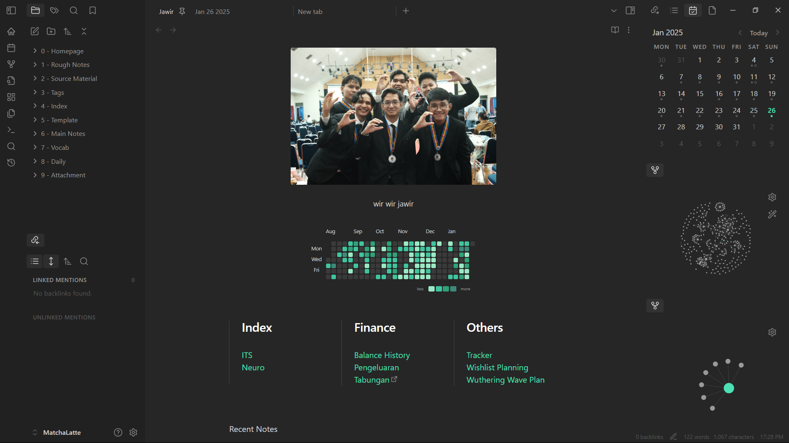
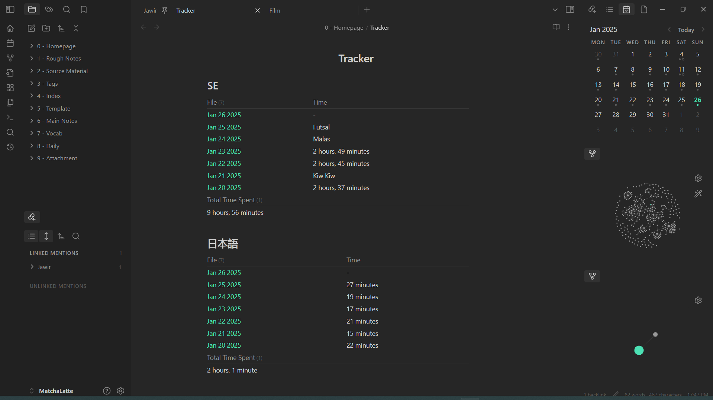
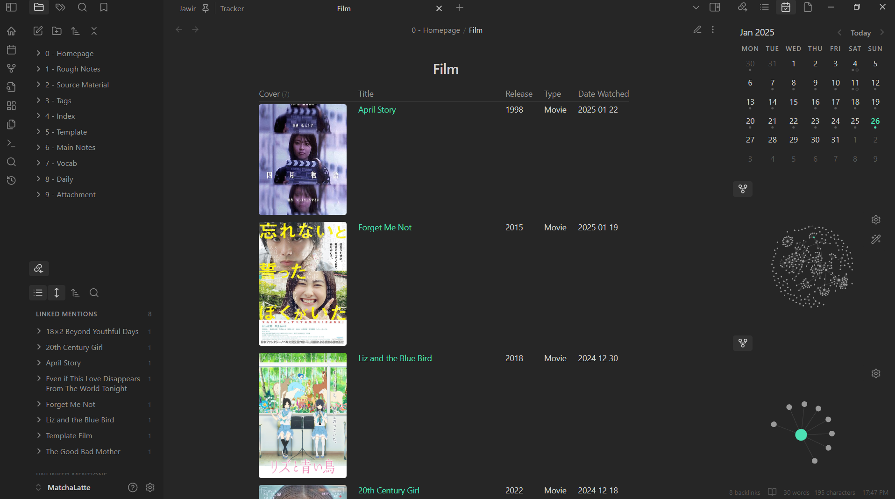

## Theme
I use Minimal theme :D

## Plugin 
All of my plugin could be found on [this folder](plugins) <br>
my most used ones are :
- Calendar
- Dataview
- Contribution Graph
- Hider
- Homepage
- Style Settings


## Homepage


### Centered Img
there are two ways you could center an img using snippet
- [ceter img](snippets/centerimg.css)
- [center title](snippets/center_title.css)

#### center img 
(+) Works in reading and editing mode <br>
(-) Applied to every img on your obsidian notes 

#### center title
(+) You could select which img you want to center because it only select h1 element <br>
(-) Unfortunately doesn't work on reading mode<br>
to use this you need to put `#` before your img

### Heat Map
for the heat map, I use a comumunity pluggin called [Contribution Graph](https://github.com/vran-dev/obsidian-contribution-graph) by vran

### Multi Colomn
I use the [MCL Multi Column](snippets/MCLMultiColumn.css) snippet 
```
>[!multi-column] 
>> # Index
>> [[ITS]]
>> [[Neuro]]
>
>> # Finance
>> [[Balance History]]
>> [[Pengeluaran]]
>> [Tabungan](a link to my spreadsheet)
>
>> # Others
>> [[Tracker]]
>> [[Wishlist Planning]]
>> [[Wuthering Wave Plan]]
>
```

## Tracker


tracker to track how much time I spent something. Using YAML properties on my daily note, and then sum it using Dataview
### Last 7 day
```dataview
table SE AS Time
from "8 - Daily"
SORT file.mtime desc

Limit 7
```
### Sum 
```dataview 
TABLE WITHOUT ID sum( filter(flat(rows.SE), (r) => typeof(r) = "duration" )) as "Total Time Spent" 
FROM #Daily 
GROUP BY true
```

## Movie Archive

To track what movie I watched usign YAML and dataview

```dataview
table without ID  Cover, file.link AS Title, Release_Year AS Release, Type, Date_Watched as "Date Watched"
from #Film 
where file.name != "Template Film"
sort Date_Watched desc
```


